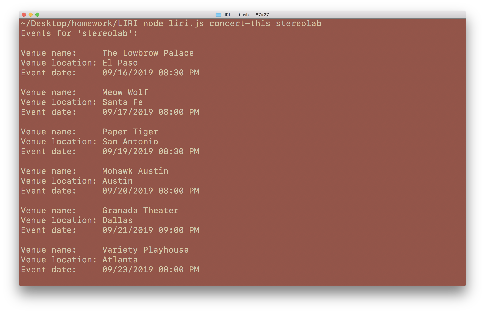
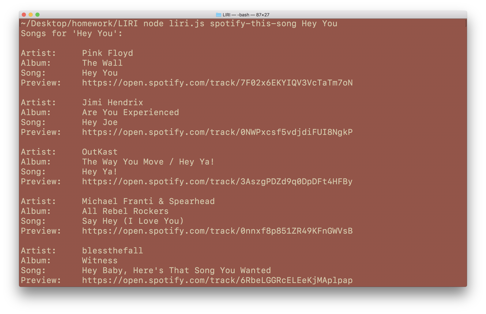
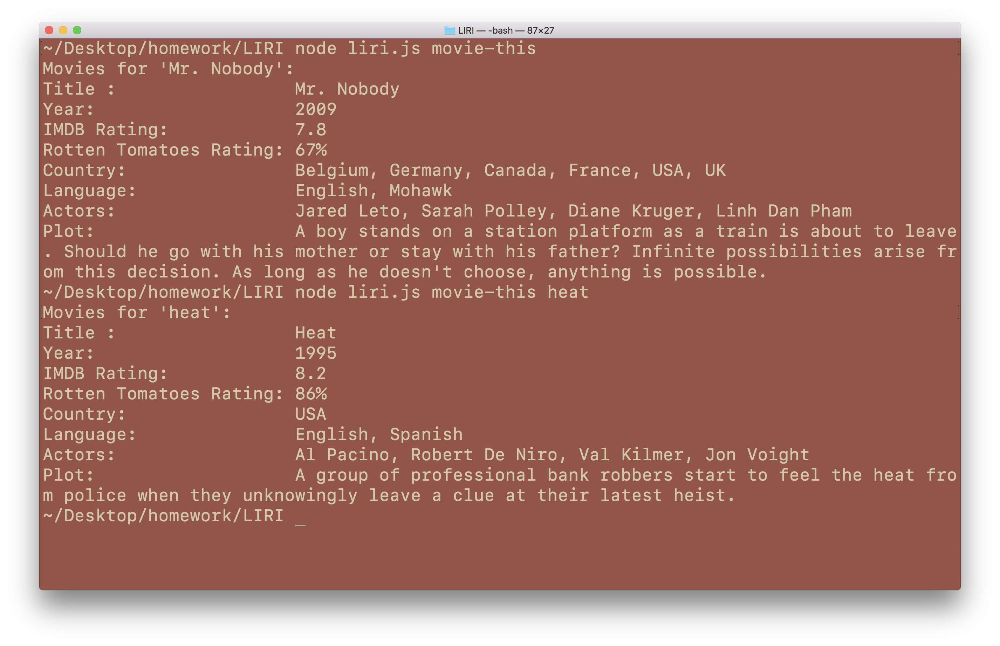
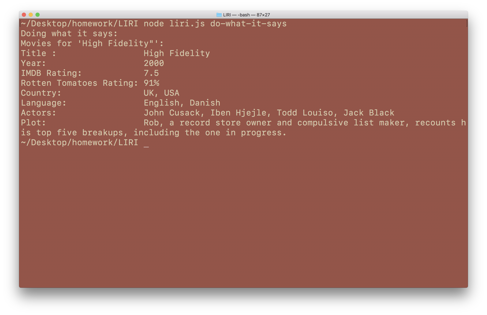

# LIRI

LIRI is a Siri-like command line app that queries Spotify, OMDB and bandsintown APIs in response to specific commands, and returns relevant information on music artists, movies, and live shows nearby. 

## Setup

`npm install`

Create a file named `.env` and add the following:
```
SPOTIFY_ID = <your spotify id>
SPOTIFY_SECRET = <your spotify secret>
OMDB_API_KEY = <your omdb api key>
```
 

## commands

### `concert-this`
List concerts in the area  
`$ node liri.js concert-this <your search term>`  



### `spotify-this-song`
Search for spotify songs  
`$ node liri.js spotify-this-song <your search term>`  



### `movie-this`
Search for movies  
`$ node liri.js movie-this <your search term>`  



### `do-what-it-says`
Do something random! A commands is randomly selected from `random.txt`  
`$ node liri.js do-what-it-says`
